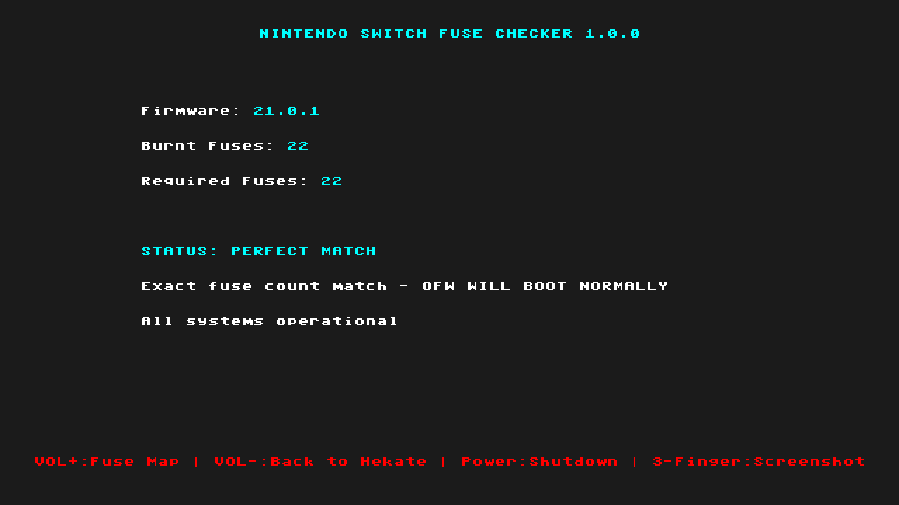

# FuseCheck - Nintendo Switch Fuse Compatibility Checker

<p align="center">
  
</p>

A Nintendo Switch payload that checks your console's burnt fuse count against the installed firmware version to determine if Official Firmware (OFW) will boot properly.

> **Based on:** [Lockpick_RCMaster](https://github.com/THZoria/Lockpick_RCMaster) by THZoria, with fuse checking logic inspired by the fuse-check project and UI design from TegraExplorer.

## What is FuseCheck?

FuseCheck is a bare-metal payload that helps you understand if your Nintendo Switch will boot into Official Firmware (OFW) based on your current fuse count and installed firmware version. This is critical for users who have been using CFW and want to know if they can safely boot into stock firmware.

### Why Do Fuses Matter?

Nintendo uses a hardware anti-downgrade mechanism called "fuse burning." Each major firmware update burns additional fuses, and the console checks this count during boot:

- **Too few fuses burnt** = Console will black screen on OFW boot
- **Correct fuse count** = OFW will boot normally
- **Extra fuses burnt** = OFW will boot, but you can't downgrade below a certain version

## Features

- **Automatic Firmware Detection** - Detects firmware version from SystemVersion NCA in SYSTEM partition
- **Hardware Fuse Reading** - Reads burnt fuse count directly from hardware registers
- **Compatibility Analysis** - Compares fuses against firmware requirements
- **Horizontal UI Layout** - Clean, TegraExplorer-inspired interface
- **Fuse Database Viewer** - Browse complete fuse requirements for all firmware versions
- **Scrolling Support** - Navigate through unlimited database entries
- **Screenshot Support** - Capture results with 3-finger touch gesture
- **Silent Key Derivation** - Keys derived in RAM only, no files written to SD
- **External Database** - Easy-to-update database file (no recompilation needed)
- **Auto-Return to Hekate** - Launches bootloader/update.bin after exit

## Status Indicators

### CRITICAL ERROR
- **Condition**: Burnt fuses < Required fuses
- **Result**: **OFW WILL NOT BOOT** (black screen)
- **What will work**: CFW (Atmosphère), Semi-stock (Hekate nogc)
- **What won't work**: Stock OFW

### CRITICAL ERROR (OVERBURNT)
- **Condition**: Burnt fuses > Required fuses
- **Result**: **OFW WILL NOT BOOT** (black screen)
- **What will work**: CFW (Atmosphère), Semi-stock (Hekate nogc)
- **What won't work**: Stock OFW
- **Note**: Cannot downgrade below firmware version matching burnt fuse count

### PERFECT MATCH
- **Condition**: Burnt fuses = Required fuses
- **Result**: **OFW WILL BOOT NORMALLY**
- **Note**: System is in ideal state for both CFW and OFW

## Installation

1. Download the latest zip from the [Releases](https://github.com/sthetix/FuseCheck/releases) page
2. Extract the zip to the sd card
3. Boot into Hekate
5. Launch FuseCheck from the payloads menu

## Usage

### Main Page (Fuse Check Results)

The main page displays:
- **Firmware Version** - Auto-detected from SYSTEM partition
- **Burnt Fuses** - Hardware fuse count (X / 32)
- **Required Fuses** - Fuses needed for detected firmware
- **Status** - Color-coded compatibility result
- **Detailed Info** - What will/won't work based on fuse status

**Controls:**
- **VOL+** - View Fuse Database (all firmware versions)
- **VOL-** - Return to Hekate
- **Power** - Shutdown console
- **3-Finger Touch** - Take screenshot

### Fuse Database Page

View complete fuse requirements for all Nintendo Switch firmware versions:
- System version ranges
- Production unit fuse counts
- Development unit fuse counts
- Scroll indicator showing position [start-end/total]

**Controls:**
- **VOL+** - Scroll down (stops at bottom)
- **VOL-** - Scroll up (stops at top)
- **Power** - Return to main page
- **3-Finger Touch** - Take screenshot

## Database Configuration

FuseCheck uses an external database file for easy updates without recompilation.

### Database Location
```
sd:/config/fusecheck_db.txt
```

### Database Format

The database file supports two entry types:

#### Fuse Count Entries
```
[FUSE] <version_range> <prod_fuses> <dev_fuses>
```

Example:
```
[FUSE] 21.0.0-21.0.1 22 1
[FUSE] 20.0.0-20.5.0 21 1
[FUSE] 19.0.0-19.0.1 20 1
```

- **version_range**: Firmware version or range (e.g., "21.0.0" or "20.0.0-20.5.0")
- **prod_fuses**: Burnt fuses required for production units
- **dev_fuses**: Burnt fuses required for development units

Source: [switchbrew.org/wiki/Fuses](https://switchbrew.org/wiki/Fuses) (Anti Downgrade section)

#### NCA Entries
```
[NCA] <version> <nca_filename>
```

Example:
```
[NCA] 21.0.1 e7273dd5b560d0ba282fc64206fecb56.nca
[NCA] 21.0.0 4b0130c8b9d2174a6574f6247655acc0.nca
[NCA] 20.5.0 23ce01f1fc55e55a783162d456e5ca58.nca
```

- **version**: Exact firmware version (e.g., "21.0.1")
- **nca_filename**: SystemVersion NCA filename (Title ID 0100000000000809)

#### Comments
Lines starting with `#` are treated as comments:
```
# This is a comment
# You can add notes about firmware updates here
```

### Updating the Database

When new Switch firmware is released:

1. Update the `[FUSE]` section with new fuse count from switchbrew
2. Update the `[NCA]` section with the new SystemVersion NCA filename
3. Copy the updated file to `sd:/config/fusecheck_db.txt`
4. **No recompilation needed!**

A sample database file is included in the repository at `fusecheck_db.txt`.

## How It Works

### Technical Details

1. **Hardware Initialization** - Initializes display, storage, and DRAM
2. **Silent Key Derivation** - Derives BIS keys in RAM using Lockpick_RCM engine
3. **Fuse Reading** - Reads ODM7 fuse register and counts burnt fuses
4. **SYSTEM Partition Access** - Mounts SYSTEM partition using BIS key 2
5. **Firmware Detection** - Scans `/Contents/registered/` for SystemVersion NCA
6. **Database Matching** - Matches NCA filename against external database
7. **Compatibility Check** - Compares burnt fuses vs required fuses
8. **Status Display** - Shows results in horizontal layout

### Fuse-to-Firmware Mapping

Based on [switchbrew.org/wiki/Fuses](https://switchbrew.org/wiki/Fuses):

| Firmware Range | Fuses Required |
|----------------|----------------|
| 1.0.0 | 1 |
| 2.0.0-2.3.0 | 2 |
| 3.0.0 | 3 |
| 3.0.1-3.0.2 | 4 |
| 4.0.0-4.1.0 | 5 |
| 5.0.0-5.1.0 | 6 |
| 6.0.0-6.1.0 | 7 |
| 6.2.0 | 8 |
| 7.0.0-8.0.1 | 9 |
| 8.1.0 | 10 |
| 9.0.0-9.0.1 | 11 |
| 9.1.0-9.2.0 | 12 |
| 10.0.0-10.2.0 | 13 |
| 11.0.0-12.0.1 | 14 |
| 12.0.2-13.1.0 | 15 |
| 13.2.1-14.1.2 | 16 |
| 15.0.0-15.0.1 | 17 |
| 16.0.0-16.1.0 | 18 |
| 17.0.0-18.1.0 | 19 |
| 19.0.0-19.0.1 | 20 |
| 20.0.0-20.5.0 | 21 |
| 21.0.0-21.0.1 | 22 |

### Key Derivation

- Uses `derive_bis_keys_silently()` from Lockpick_RCM
- Works on both Erista (TSEC keygen) and Mariko (Mariko KEK)
- All keys stay in RAM, no SD card writes
- Graphics output muted during key derivation

### Firmware Detection

- Mounts SYSTEM partition using derived BIS key 2
- Scans `/Contents/registered/` directory for NCA files
- Matches NCA filenames against external database
- Falls back to hardcoded fuse map if database not found
- Returns firmware version (major.minor.patch)

## Building from Source

### Prerequisites

- [devkitARM](https://devkitpro.org/) toolchain
- Git (for cloning repository)
- Windows with MSYS2 (for Windows builds) or Linux/macOS

### Build Instructions

```bash
# Clone the repository
git clone https://github.com/sthetix/FuseCheck.git
cd FuseCheck

# Build the payload
make

# Output: fusecheck.bin
```

### Build System

- **Makefile** - Uses standard devkitARM toolchain
- **Source**: `source/main.c` (all-in-one implementation)
- **Libraries**: Uses Hekate BDK for hardware access
- **Output**: `fusecheck.bin` (payload binary)

## Troubleshooting

### "Failed to derive keys!"
- **Cause**: Unable to derive BIS keys from TSEC/Mariko
- **Solution**: Ensure you're using a properly dumped firmware or try rebooting

### Firmware shows as "1.0.0"
- **Cause**: NCA detection failed or database not found
- **Solution**: Copy `fusecheck_db.txt` to `sd:/config/fusecheck_db.txt`

### "Database file not found!" in Fuse List
- **Cause**: Missing `fusecheck_db.txt` on SD card
- **Solution**: Copy the database file to `sd:/config/` directory

### SYSTEM partition mount fails
- **Cause**: BIS key 2 derivation failed
- **Solution**: This is rare - try rebooting or check eMMC health

## Comparison to Related Projects

### vs Lockpick_RCM
- **Same**: Key derivation engine, hardware initialization
- **Different**: No key file dumping, focused on fuse checking only

### vs fuse-check
- **Same**: Fuse compatibility checking logic
- **Different**: Complete implementation with UI, database, and auto-detection

### vs TegraExplorer
- **Same**: Horizontal UI layout style
- **Different**: Single-purpose tool for fuse analysis

## Credits and Attribution

This project combines work from multiple excellent Switch projects:

- **[CTCaer](https://github.com/CTCaer/hekate)** - Hekate bootloader, BDK libraries, hardware initialization
- **[shchmue](https://github.com/shchmue)** - Original Lockpick_RCM, key derivation engine
- **[THZoria](https://github.com/THZoria/Lockpick_RCMaster)** - Lockpick_RCMaster base
- **[TegraExplorer](https://github.com/suchmememanyskill/TegraExplorer)** - Horizontal UI design inspiration
- **[switchbrew.org](https://switchbrew.org/wiki/Fuses)** - Fuse documentation and mapping
- **ReSwitched community** - Research, documentation, and support

Special thanks to **CTCaer** for excellent documentation and reusable code architecture.

## License

FuseCheck is licensed under **GPLv2** (same as parent projects).

This project is built on top of:
- Hekate (GPLv2) - Hardware libraries
- Lockpick_RCM (GPLv2) - Key derivation
- hactool (ISC) - Save processing module

## Disclaimer

This tool is for **educational and diagnostic purposes only**. Use at your own risk. The authors are not responsible for any damage, data loss, or banned consoles. Always keep backups of important data.

**Note:** This tool does NOT modify fuses or firmware. It only reads and analyzes existing fuse state.

## Support My Work

If you find this project useful, please consider supporting me!

<a href="https://www.buymeacoffee.com/sthetixofficial" target="_blank">
  
</a>

---

**Repository:** https://github.com/sthetix/FuseCheck
**Issues:** https://github.com/sthetix/FuseCheck/issues
**Latest Release:** https://github.com/sthetix/FuseCheck/releases
